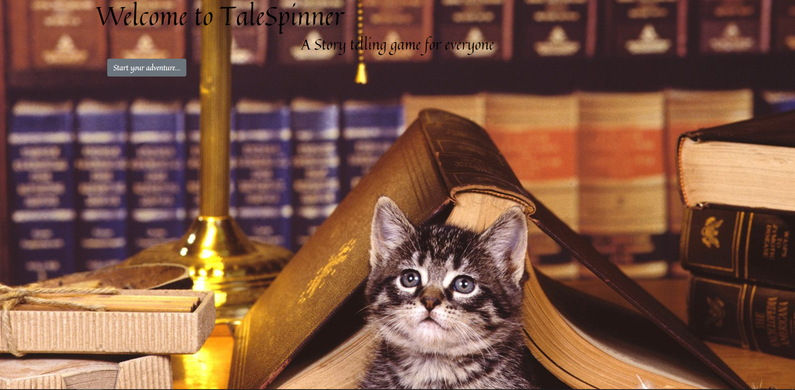
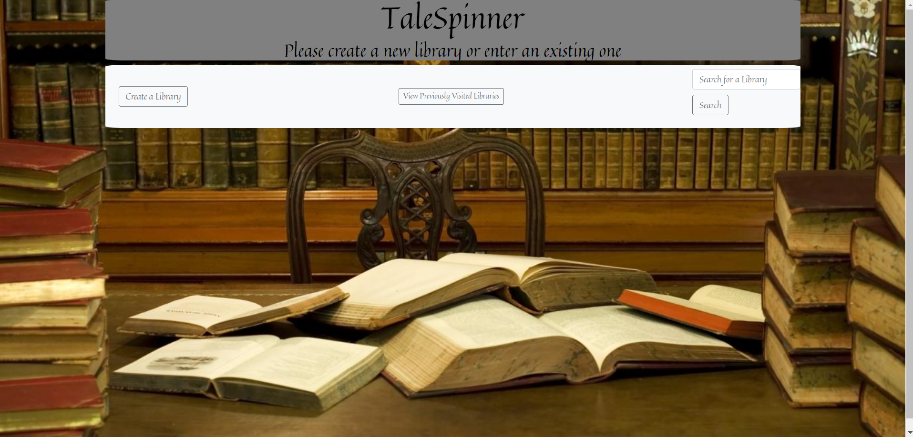
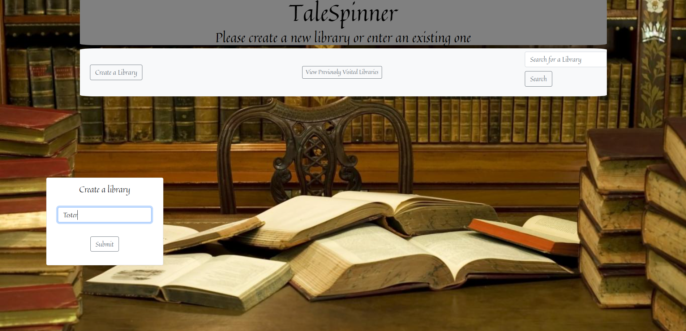
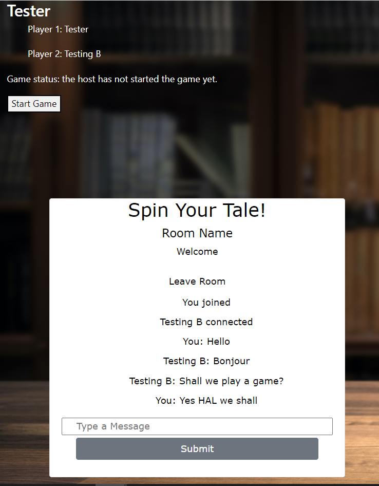

# Tale Spinner

## Overview:
Tale Spinner is a turn-based text storytelling game that allows multiple parties of 2-4 friends the ability to remotely access, and play, our game within player created chatrooms.

## Table of Contents 
- [Description](#description)
- [User Story](#user_story)
- [Images](#images)
- [Pages](#pages)
- [Collaborators](#collaborators)
- [License](#license)

## Description:
A collaborative turn-based text storytelling game for 2-4 players. The “talespinner” supplies a randomized genre and some random items or characters for a player to use in the first line of the tale. Then that player gives the next player a new story element that they must incorporate in the next line of the tale.

## User Story:

```
AS A lonely human seeking fun in these post-apocalyptic covid times
I WANT to be able to create a story with my friends from afar, so that we can laugh and have fun and forget how miserable we are, with no pressure to be super creative
WHEN I start the application 
THEN I am presented with the home page, showing the title of the app and its use, including a start button 
WHEN I click the start button
THEN I am taken to a page where I can create or join a lobby, of up to 4 players, with the option to enter in my name
WHEN I have at least 2 players in a lobby, I can hit start game
THEN I am taken to another page where I am presented with a prompt box, where the app will present us with an assigned genre, a setting, an object, and a character.
WHEN the app has assigned the elements
THEN Player 1 writes 2-3 sentences to start the story with a given timeframe
WHEN Player 1 hits submit
THEN their sentences appear on the right side of the page, in the written story section for all players to see
WHEN player 1 has submitted their sentences
THEN Player 1 is prompted to create 1-2 elements, such as a character, object, or setting for the next player to use
WHEN player 1 has entered in their chosen elements
THEN Player 2 will create the next 3 sentences, using the elements Player 1 has chosen, which appear on the right side of the page, in the written story section for all players to see
WHEN Player 2 has finished typing their sentences
THEN Player 2 is prompted to create 1-2 elements, such as a character, object, or setting for the next player to use
WHEN It is not my turn 
THEN I can chat in the chat box with the other players, while I wait 
WHEN all players have had their turn
THEN the entire story will be unfolded in the written story section
```

## Images:





## Pages:

To enjoy our game on Heroku, please click [HERE](https://talespinner.herokuapp.com/)
The code can be located at the [Github Repository](https://github.com/Abrock3/Talespinner)

## Collaborators:
[Laura Antunez](https://github.com/lauraantunez024), [Erica Breig](https://github.com/EricaBreig), [Adam Brock](https://github.com/Abrock3), and [Corey Levine](https://github.com/coreylevine2000)

## License:
MIT License

[](https://opensource.org/licenses/MIT)

Copyright (c) 2022 of [Laura Antunez](https://github.com/lauraantunez024), [Erica Breig](https://github.com/EricaBreig), [Adam Brock](https://github.com/Abrock3), and [Corey Levine](https://github.com/coreylevine2000)

Permission is hereby granted, free of charge, to any person obtaining a copy
of this software and associated documentation files (the "Software"), to deal
in the Software without restriction, including without limitation the rights
to use, copy, modify, merge, publish, distribute, sublicense, and/or sell
copies of the Software, and to permit persons to whom the Software is
furnished to do so, subject to the following conditions:

The above copyright notice and this permission notice shall be included in all
copies or substantial portions of the Software.

THE SOFTWARE IS PROVIDED "AS IS", WITHOUT WARRANTY OF ANY KIND, EXPRESS OR
IMPLIED, INCLUDING BUT NOT LIMITED TO THE WARRANTIES OF MERCHANTABILITY,
FITNESS FOR A PARTICULAR PURPOSE AND NONINFRINGEMENT. IN NO EVENT SHALL THE
AUTHORS OR COPYRIGHT HOLDERS BE LIABLE FOR ANY CLAIM, DAMAGES OR OTHER
LIABILITY, WHETHER IN AN ACTION OF CONTRACT, TORT OR OTHERWISE, ARISING FROM,
OUT OF OR IN CONNECTION WITH THE SOFTWARE OR THE USE OR OTHER DEALINGS IN THE
SOFTWARE.